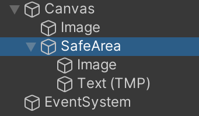

# mobile-safearea
这是一个Unity插件，帮助程序判断当前设备是否有刘海，以及刘海的高度等。

## 功能
1. 判断设备是否有刘海，获取刘海屏的高度
2. 支持Android和iOS（未来还会支持HarmonyOS）
3. 支持折叠屏（分辨率发生变化时会发出通知）

## Unity组件
插件提供一个Unity组件：SafeAreaComponent
它会在有刘海的设备上自动伸缩
你可以将不希望被挡住的UI内容都放在组件子节点下


## 代码调用
### 获取刘海高度
```csharp
//获得的高度是0.0-1.0范围内的值，代表刘海占用屏幕的比值
float unit = SafeAreaUtls.GetTopOffsetUnit();
```

### 监听分辨率变化
```csharp
private void Start()
{
    sb = new StringBuilder();
    SafeAreaUtls.AddResolutionChanged(OnReChanged);
}

private void OnDestroy()
{
    SafeAreaUtls.RemoveResolutionChanged(OnResolutionChanged);
}

//回调方法是在Unity主线程运行
void ResolutionChanged()
{
    Debug.LogError("Resolution has Changed");
}
```
